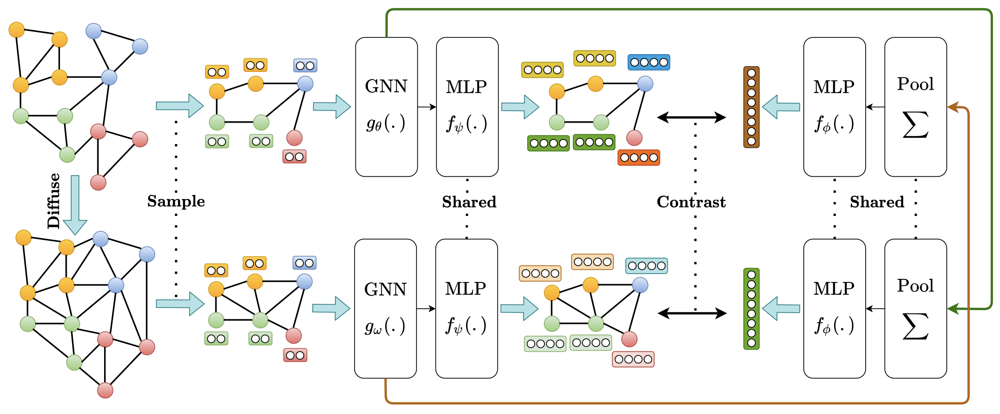

# Contrastive Multi-View Representation Learning on Graphs

This work introduces a self-supervised approach based on contrastive multi-view
learning to learn node and graph level representations.

It has been accepted at ICML 2020:

[https://arxiv.org/abs/2006.05582](https://arxiv.org/abs/2006.05582)

<br/>
<br/>





## Reference

```
@incollection{icml2020_1971,
 author = {Hassani, Kaveh and Khasahmadi, Amir Hosein},
 booktitle = {Proceedings of Machine Learning and Systems 2020},
 pages = {3451--3461},
 title = {Contrastive Multi-View Representation Learning on Graphs},
 year = {2020}
}
```
